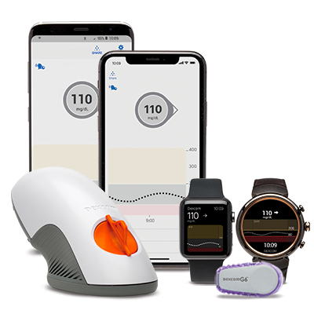
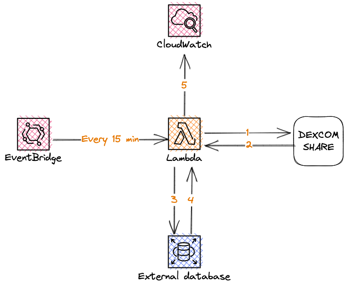

# cgm-handler

A serverless application for collecting and synchronizing data from the Dexcom G6 device to a database.

## Overview

The cgm-handler application is designed to collect and store data from the Dexcom G6 continuous glucose monitoring (CGM) device. It uses a serverless (lambda) architecture, where the main function is triggered every 15 minutes by an Amazon EventBridge event. The data is stored in a database, allowing users to easily access and analyze their glucose readings.

## Technical details

The cgm-handler application is written in Node.js and uses the AWS CDK to deploy the application to AWS. The main function retrieves data from the Dexcom API, processes the data, and stores it in a database. The application uses free postgres (NEON) for the database, and AWS ECR to securely store application docker images.

The ideal architecture for this application would be to have both the Lambda function and the database in a private subnet for added security. However, due to cost considerations, a free pg Neon database has been used and everything is currently in a public network.

## Releasing a New Version
Releasing a new version of the CGM Handler application will trigger the second repository, [cgm-handler-infrastructure](https://github.com/BartekCK/cgm-handler-infrastructure), which contains the infrastructure as code (IAAC) to deploy the updated lambda function with the new image.

The serverless architecture is based on AWS Lambda containers, which take the updated image from AWS Elastic Container Registry (ECR). The IAAC code in the cgm-handler-infrastructure repository will automatically pull the latest version of the image and deploy it to the lambda function.

## Testing
The CGM Handler application contains unit tests, integration tests, and contract tests to ensure the stability and reliability of the application. These tests validate the interactions between the application and the Dexcom API, ensuring that changes made by Dexcom do not affect the application's ability to function properly.

To further enhance the quality assurance process, the application uses the AWS Lambda runtime interface emulator [aws-lambda-runtime-interface-emulator](https://github.com/aws/aws-lambda-runtime-interface-emulator) to verify the successful build of the image for the lambda function on every push to the repository. This ensures that the serverless architecture is functioning as expected and that the latest version of the application is ready for deployment.

## Deployment
The cgm-handler application is deployed using AWS CloudFormation. The application can be deployed using the AWS Management Console, the AWS CLI, or by using an automated pipeline with GitHub Actions.

## Requirements
In order to use the cgm-handler application, you will need:

- An AWS account
- A Dexcom G6 device
- A Dexcom Share username and password
- A database

## License
The cgm-handler application is open-source and is released under the MIT license.
